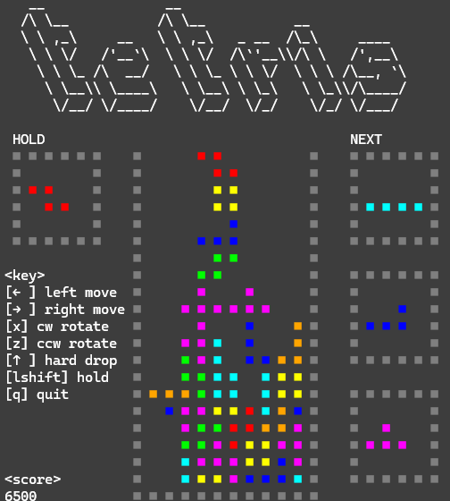

# tetris-cli

ターミナル上で動作する、カラフルなグラフィックとスムーズなゲームプレイを備えたテトリスゲーム(Python実装)です。



## 機能

- **クラシックなテトリスゲームプレイ**: 7種類の標準テトリミノ (I, O, T, S, Z, J, L)
- **7-Bagランダマイザー**: 現代的な7-bag方式による公平なピース配分
- **ゴーストピース**: アクティブなピースの落下位置を視覚的にプレビュー
- **ホールド機能**: ピースを保存して後で使用、入れ替えが可能
- **ネクストピースプレビュー**: 次に出現する3つのピースを表示
- **スコアシステム**: スコアでパフォーマンスを記録
- **スムーズな操作**: オートリピート対応のレスポンシブなキーボード入力
- **カラフルな表示**: RGBカラー対応のターミナルベースレンダリング

## アーキテクチャ

### 主要コンポーネント

- **TetriminoManager**: アクティブ、ホールド、ゴーストピースを管理。衝突判定は依存性注入で実装
- **Board**: ゲームボードの状態管理とライン消去ロジック
- **ScoreManager**: スコア計算と記録
- **Render (バッファベース)**: スムーズな表示のためのダブルバッファレンダリングシステム
- **Command Pattern**: 入力処理とゲームロジックの明確な分離
- **7-Bag Spawner**: 公平なランダム化を保証する事前生成キューシステム

### 設計原則

- コンポーネント境界が明確な関心の分離
- テスト可能性のための依存性注入
- コードベース全体での型ヒント使用

## 操作方法

| キー | 動作 |
|-----|--------|
| `←` | 左移動 |
| `→` | 右移動 |
| `↓` | ソフトドロップ (高速落下) |
| `↑` | ハードドロップ (即座に落下) |
| `x` | 時計回り回転 |
| `z` | 反時計回り回転 |
| `Left Shift` | ホールド |
| `q` | ゲーム終了 |

## インストール

### 必要要件

- Python 3.10以上
- Poetry (推奨) または pip

### Poetryでのセットアップ (推奨)

```bash
# 依存関係のインストール
poetry install

# ゲームの起動
poetry run python -m tetris_cli
```

## 開発

### テストの実行

```bash
# 全テストを実行
poetry run pytest

# カバレッジレポート付きで実行
poetry run pytest --cov=tetris_cli

# 詳細なカバレッジレポート付きで実行
poetry run pytest --cov=tetris_cli --cov-report=term-missing
```

## 技術詳細

### 依存パッケージ

- `pynput`: キーボード入力処理
- `colorama`: ターミナルカラーサポート
- `pytest`: テストフレームワーク
- `pytest-cov`: カバレッジレポート

### レンダリングシステム

カスタムバッファベースレンダリングシステムを使用:

- ブロック用の全角文字 (■) (2ピクセル幅)
- colorama経由のRGBカラーサポート
- スムーズなフレーム更新のためのカーソル位置制御
- ゴースト、アクティブ、固定ピース用の独立したレンダリングレイヤー

### テトリミノシステム

- **TetriminoDefine**: 回転状態と色を定義するイミュータブルなデータクラス
- **Tetrimino**: 位置と回転状態を持つミュータブルなインスタンス
- **TetriminoSpawner**: 7-bag方式によるキューベースのスポーナー
- **TetriminoManager**: 全ピース関連操作を管理するファサード
